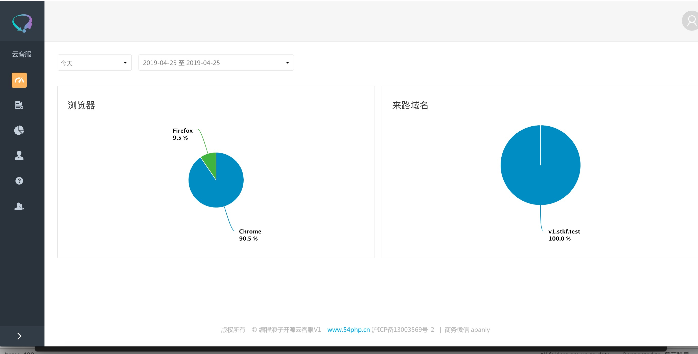
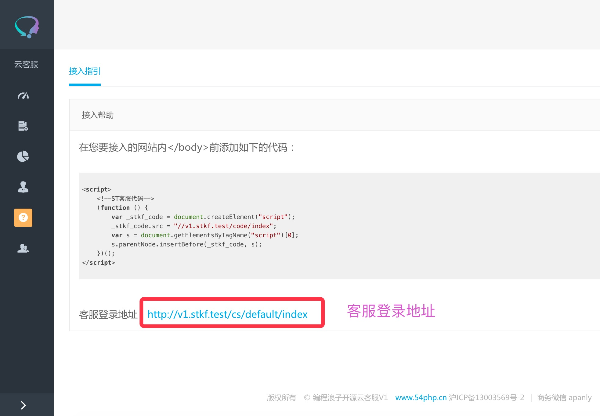
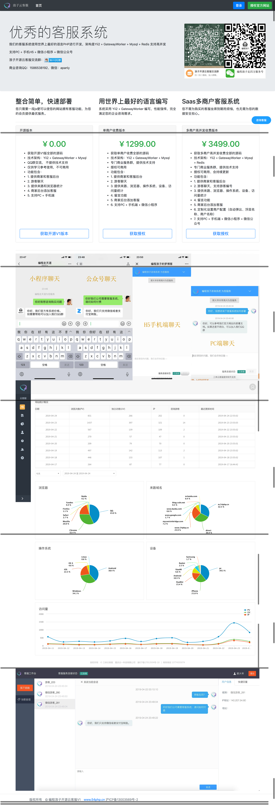
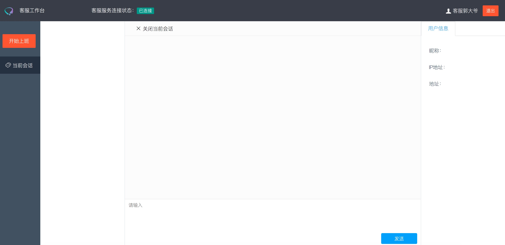

编程浪子开源云客服
=========
## 前提说明
#### 本系统不在维护，因为正在开发更好的版本，所以本系统不在维护，大家可以根据自己实际情况选用，敬请期待新的版本面世
* [github 欢迎star:https://github.com/apanly/open_kf_v1](https://github.com/apanly/open_kf_v1)
* 演示地址
    * [PC：http://www.54php.cn/](http://www.54php.cn/)
    * [手机H5：http://m.54php.cn/](http://m.54php.cn/)
    * 交流QQ群：790102844

## 环境准备
* nginx + mysql + php
* [nginx的配置](./docs/nginx/kefu.conf)
* [数据库文件：saas_stkf_v1](./docs/saas_stkf_v1.sql)
* YII2 配置
    * [如果不会配置YII2 可以参考YII2中文官网](https://www.yiichina.com/doc/guide/2.0)
    * 数据库配置：common/config/main-local.php
    * 访问系统域名配置：common/config/params-local.php
* [课程使用vendor，切记文件夹名称是 vendor ](https://pan.baidu.com/s/1riMKPdSHLPdZK1-pMfFWvw)

## 启动websocket
* php console/server_jobs/start.php start

## 账号说明
* 管理员测试账户 用户名：54php.cn 密码：123456
* 客服测试账户 用户名：54php.cn 密码：123456

## 客服系统如何使用
* 在websocket 服务启动之后，登录客服系统，点击 开始上班。 就可以进行沟通了

## 展示图
* 
* 
* 
* 

## 参考文档
* [Workerman](https://www.workerman.net/)
* [GatewayWorker](http://workerman.net/gatewaydoc/)
* [YII2中文官网](https://www.yiichina.com/doc/guide/2.0)
